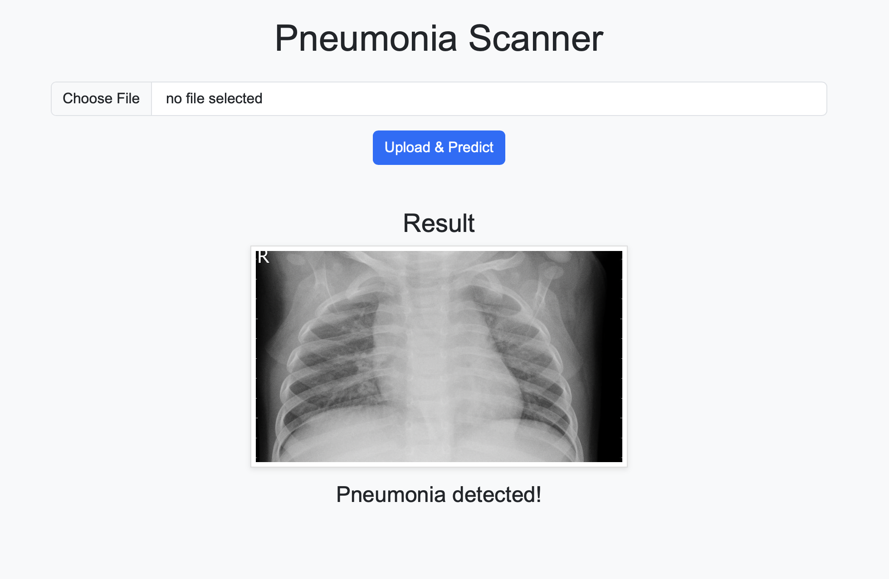

# Pneumonia Detection from Chest X-Ray Images

This project is designed to detect pneumonia from chest X-ray images using a deep learning model. The model is based on the ResNet18 architecture and is trained on a dataset of chest X-ray images. The project includes a Jupyter Notebook for training the model, a Python script for handling predictions, a Flask web application for interactive use, and Docker support for easy deployment.

## Table of Contents

- [Project Overview](#project-overview)
- [Installation](#installation)
- [Usage](#usage)
- [Docker Setup](#docker-setup)
- [File Structure](#file-structure)
- [License](#license)

## Project Overview

The goal of this project is to classify chest X-ray images into two categories: **Normal** and **Pneumonia**. Below is a screenshot of the Flask web application in action:



### Sample Input and Output

Here are examples of the input (chest X-ray images) and the corresponding predictions:

| **Normal X-Ray** | **Pneumonia X-Ray** |
|------------------|---------------------|
|  |  |


- **Training Script**: A Jupyter Notebook (`chest.ipynb`) for training the model on a dataset of chest X-ray images.
- **Prediction Handler**: A Python script (`handler.py`) for loading the trained model and making predictions on new images.
- **Web Application**: A Flask web application (`app.py`) that allows users to upload chest X-ray images and get predictions in real-time.
- **Docker Support**: Docker configuration for easy deployment and running of the application.

## Installation

To set up the project, follow these steps:

1. **Clone the repository**:
   git clone https://github.com/umayyentur/Chest_X-Ray_Images_-Pneumonia.git
   
   `cd pneumonia-detection`

2. **Install the required dependencies:**   
    `pip install -r requirements.txt`


3. **Download the dataset:**
    The dataset used for training can be found [here](https://www.kaggle.com/datasets/paultimothymooney/chest-xray-pneumonia)
    
    Place the dataset in the chest_xray directory 

4. **Train the model:**
    Open the Jupyter Notebook chest.ipynb and run the cells to train the model.
    The trained model will be saved as `pneumonia_model.pth.`

5. **Run the Flask web application:**
    ```python app.py```
    The web application will be available at `http://127.0.0.1:8000`


## Usage

**Training the Model**

Open the chest.ipynb notebook and run the cells to train the model.
The notebook includes data loading, model training, and evaluation steps.

**Making Predictions**

Use the handler.py script to load the trained model and make predictions on new images.
The script expects a base64-encoded image as input and returns the predicted class (NORMAL or PNEUMONIA).

**Web Application**

Run the Flask web application using app.py.
Upload a chest X-ray image through the web interface to get a prediction.


##  Docker Setup

This project includes Docker support for easy deployment. Follow these steps to build and run the Docker container:

**Build the Docker image:**

`docker build -t pneumonia-detection .`
**Run the Docker container:**

`docker run -p 8000:8000 pneumonia-detection`
Access the web application:
Open your web browser and navigate to `http://127.0.0.1:8000`

**Dockerfile** 

The Dockerfile included in the project sets up the environment and runs the Flask web application. Here is a brief overview of the Dockerfile:

```Dockerfile
# Use an official Python runtime as a parent image
FROM python:3.10-slim

# Set the working directory in the container
WORKDIR /app

# Copy the current directory contents into the container at /app
COPY . /app

# Install any needed packages specified in requirements.txt
RUN pip install --no-cache-dir -r requirements.txt

# Make port 8000 available to the world outside this container
EXPOSE 8000

# Run app.py when the container launches
CMD ["python", "app.py"]
```

## File Structure
```markdown

pneumonia-detection/
├── chest.ipynb                # Jupyter Notebook for training the model
├── handler.py                 # Script for handling predictions
├── app.py                     # Flask web application
├── requirements.txt            # List of dependencies
├── pneumonia_model.pth         # Trained model weights
├── chest_xray/                 # Directory containing the dataset
│   ├── train/                  # Training images
│   ├── test/                   # Test images
│   └── val/                    # Validation images
└── templates/                  # Flask templates (if applicable)
    └── index.html              # HTML template for the web application
```